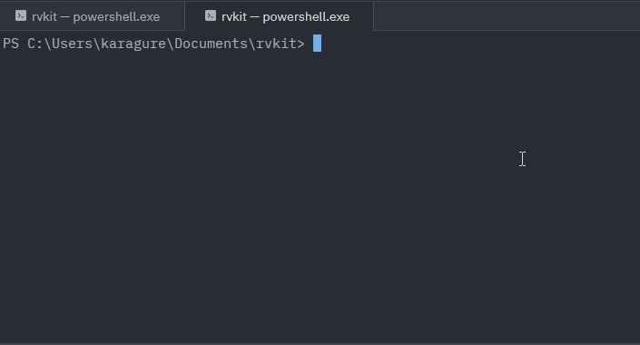

# rvkit


> **Bare metal Zig, without the bare metal pain.**



rvkit is a CLI/TUI toolchain for Zig developers targeting RISC-V microcontrollers.  
No more manual linker scripts, no more fighting your toolchain — just code, build, flash, monitor.

---

## Why rvkit ?

Setting up a bare metal Zig project on RISC-V is painful :

- Manual memory address configuration
- Board-specific linker scripts to write from scratch
- Fragmented toolchain (flash tool here, monitor there)
- No equivalent to Arduino or PlatformIO for Zig

**rvkit fixes this.** One command to scaffold a ready-to-build project, one command to flash, one command to monitor.

```bash
rvkit new --board ch32v003 my_project
cd my_project
# ... write your Zig code ...
rvkit flash
rvkit monitor
```

---

## Supported boards

|Board|Architecture|Flash tool|
|---|---|---|
|CH32V003|RISC-V 32bit|wlink (WCH-LinkE)|
|ESP32-C3|RISC-V 32bit|esptool|

More boards coming — including custom **Open & Hack** boards.

---

## Commands

|Command|Description|
|---|---|
|`rvkit new --board <target> <name>`|Scaffold a new Zig project for the target board|
|`rvkit build`|Build the project using the Zig toolchain|
|`rvkit flash`|Flash the firmware to the board|
|`rvkit monitor`|Open the serial monitor (TUI)|
|`rvkit boards`|List all supported boards|

---

## Installation

### Pre-built binaries (recommended)

Download the binary for your platform from the [latest release](https://github.com/karagure/rvkit/releases/latest):

| Platform | Binary |
|----------|--------|
| Linux x86_64 | `rvkit-linux-x86_64` |
| Linux ARM64 | `rvkit-linux-aarch64` |
| Windows x86_64 | `rvkit-windows-x86_64.exe` |
| macOS Intel | `rvkit-macos-x86_64` |
| macOS Apple Silicon | `rvkit-macos-aarch64` |

**Linux / macOS:**
```bash
chmod +x rvkit-*
sudo mv rvkit-* /usr/local/bin/rvkit
```

**Windows:**

Rename the file to `rvkit.exe`, move it to a folder of your choice (e.g. `C:\Tools\rvkit\`), and add that folder to your PATH.

### From source (for Rust developers)

```bash
git clone https://github.com/karagure/rvkit.git
cd rvkit
cargo install --path cli
```

### Verify installation

```bash
rvkit --version
```

---

## Project structure

A project generated by `rvkit new` looks like this :

```
my_project/
├── rvkit.toml       ← board config (target, flash port, baud rate)
├── build.zig        ← Zig build script (preconfigured)
├── src/
│   └── main.zig     ← your code starts here
└── linker/
    └── ch32v003.ld  ← linker script (generated, don't edit)
```

### rvkit.toml

```toml
[board]
target = "ch32v003"
flash_port = "/dev/ttyUSB0"
baud_rate = 115200
```

---

## Philosophy

- **Do one thing well** — scaffold, build, flash, monitor. Nothing more.
- **Zero surprise dependencies** — rvkit tells you exactly what it needs.
- **Your editor, your choice** — rvkit does not replace ZLS or your IDE.
- **Rust stable only** — no nightly, easier to maintain and contribute.
- **Linux first** — macOS and Windows best-effort support.

---

## Roadmap

- [x] Project scaffolding (CH32V003, ESP32-C3)
- [x] Build integration
- [x] Flash via wlink / esptool
- [ ] TUI serial monitor (ratatui)
- [ ] `rvkit boards` command
- [ ] Template auto-update
- [ ] Custom Open & Hack boards support

---

## Contributing

Contributions are welcome ! Please open an issue before submitting a PR.

This project follows the [Zig community Code of Conduct](https://ziglang.org/community/).

---

## License

MIT — see [LICENSE](LICENSE)

---

*rvkit is built with ❤️ in Rust and Zig by [Open & Hack](https://github.com/karagure)*
